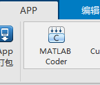
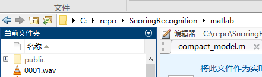
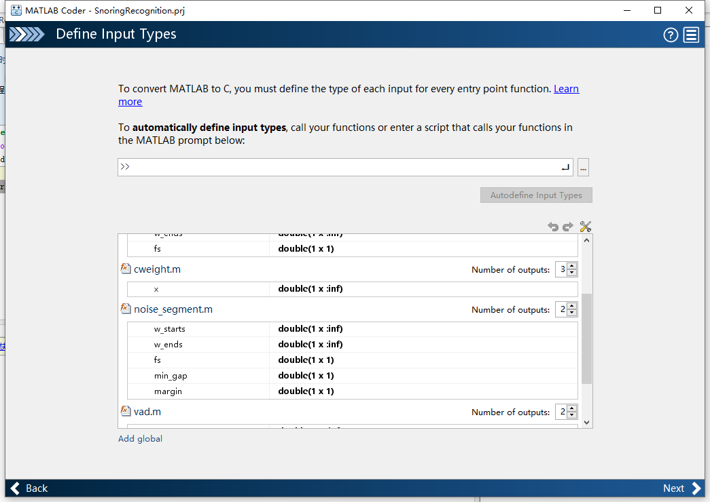

### 项目简介

该文件夹是鼾声识别matlab源码，包含训练后的模型，以及生成可移植代码的配置文件

### 准备

在调试matlab代码及，生成C++代码前，需要安装matlab，必须是支持coder



### 项目模型预处理

模型以mat文件保存到项目，经过训练保存的项目不能直接用于代码生成，需要经过预处理

````matlab
%% 加载训练模型，然后保存
mdl = load('your_model.mat');
saveLearnerForCoder(mdl, 'compact_model');

%% 在代码中加载模型的方式，以便支持coder
cpt = loadLearnerForCoder('compacted_model');
````

### 代码生成

这一步需要打开matlab，调整工作目录到当前文件夹，然后在matlab内打开SnoringRecognition.prj文件，matlab会自动打开coder并导入配置



coder打开后就可以配置入口函数、输入类型



点击next，然后点击generate，就可以生成C++代码，过程可能需要数分钟

### 可能遇到的问题

1、coder提示matlab提供的函数不支持代码生成

解决方法：右键不支持代码生成的函数，打开查看以函数为名m文件，将文件复制到项目下，然后自行改写文件。或检查函数的参数，部分函数不支持可变参量，需要switch case来解决，如pitch函数

2、coder提示变量类型错误

解决方法：尽可能避免使用cell，不同类型的变量不能互相赋值